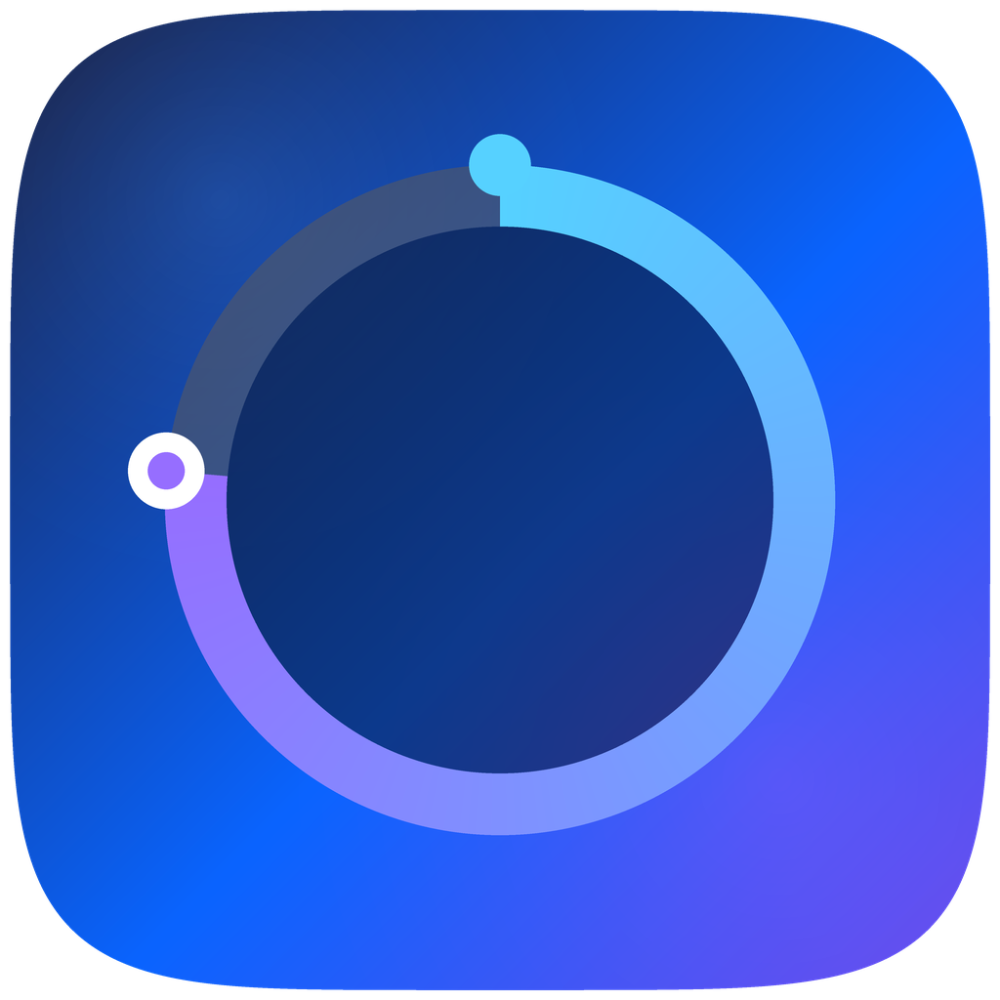
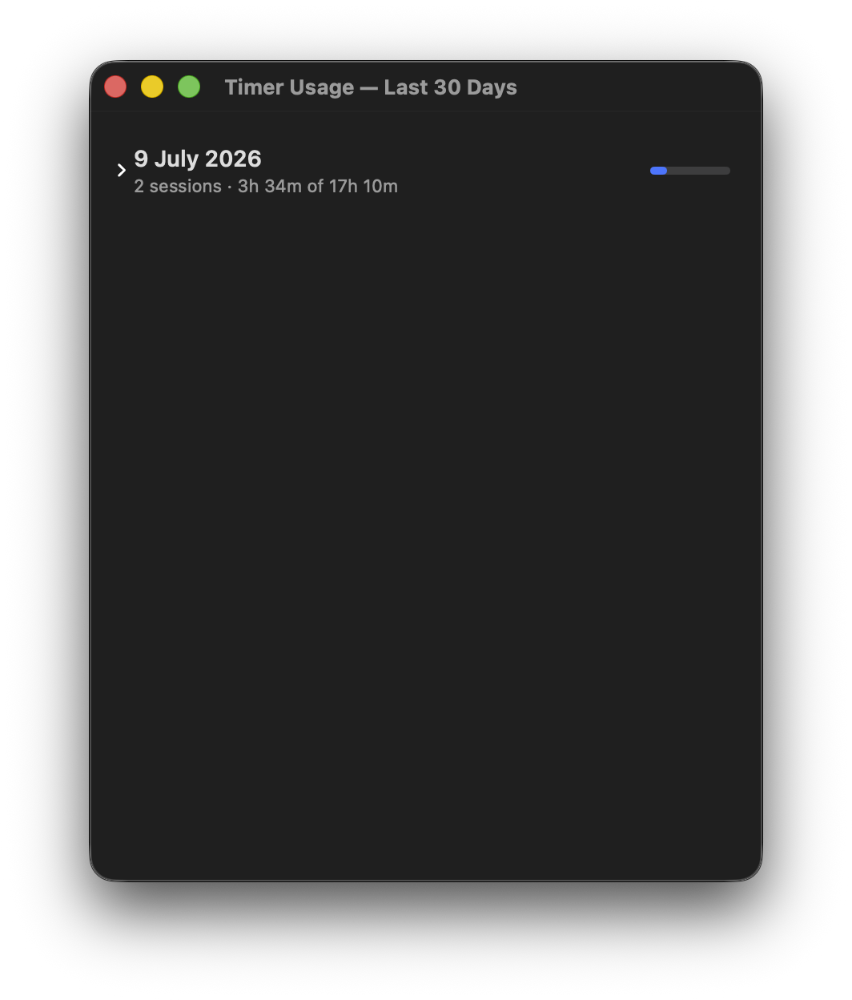
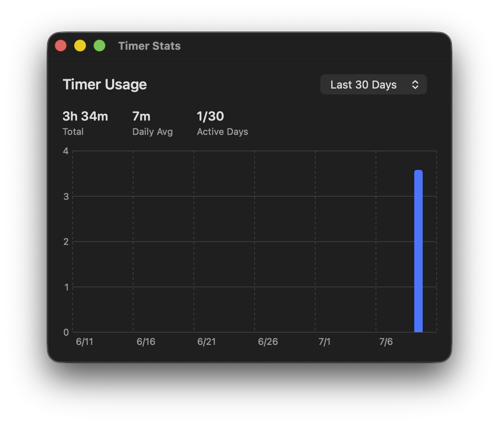

<div align="center">
  

  # Floating Timer

  **A tiny, always-on-top countdown pill for macOS.**
  Set it, pin it to your screen, and let it hold you to the time you promised yourself.

  [](#requirements)
  [](#requirements)
  [](LICENSE)
</div>

<br/>

<div align="center">
  
</div>

<br/>

Floating Timer is a lightweight, native macOS utility that keeps a small circular countdown pill floating above every window, on every Space, in every full-screen app. No Dock icon, no clutter — just a quiet timer that stays exactly where you put it.

## Why Floating Timer

Whether you're **studying**, **working**, **building** a side project, or just trying to **focus**, the hardest part usually isn't starting — it's staying honest about how long you actually meant to go for.

That's the whole idea behind this app: you set a duration, the pill stays pinned on your screen the entire time, and its draining ring is a constant, quiet reminder that you still have planned, serious time left. You can't lose track of it in a background tab or a minimized window — it's always visible, always ticking.

That visibility is the point. Knowing the timer is running — and that it's watching — nudges you to spend that time deliberately instead of drifting. It's less a productivity gadget and more a commitment device: once it's on the screen, you're far more likely to actually put in the planned time, and use it wisely.

## Features

- **Always-on-top floating pill** — a compact, translucent countdown that hovers above everything, including full-screen apps, and follows you across every Space
- **Drag it anywhere** — reposition it with a click-and-drag; it remembers exactly where you left it, even across restarts and multi-monitor setups
- **One-click control** — a single tap pauses or resumes the timer; hover to reveal quick reset and play/pause buttons without opening any menu
- **Live progress ring** — a clean circular ring drains in real time and changes color to tell you the state at a glance: white when idle, blue while running, orange when paused, and pulsing red when time is almost up
- **Instant duration presets** — right-click for one-tap durations from 5 minutes to 12 hours, or set any custom length in seconds
- **Persistent, crash-safe sessions** — your chosen duration is remembered between launches, and if the app is ever force-quit or your Mac restarts mid-timer, the interrupted session is still safely logged instead of silently lost
- **Usage History** — a day-by-day log of every session, showing how much of each planned timer you actually completed
- **Timer Stats dashboard** — a built-in bar chart (7-day or 30-day view) with total time, daily average, and active-day counts, so you can see your focus trends over time
- **Launch at Login** — have it start automatically every time you log in, ready before you even open your first app
- **Completion alert** — a system beep and a satisfying pulse animation let you know the moment a session finishes
- **100% local & private** — no network access, no accounts, no analytics. All timer history stays on your Mac, stored locally and automatically pruned after 30 days
- **Lightweight & native** — built purely with Swift, SwiftUI, and AppKit, with zero third-party dependencies

## Screenshots

<table>
  <tr>
    <td align="center" width="50%">
      
      <br/>
      <sub>Right-click for instant duration presets and quick actions</sub>
    </td>
    <td align="center" width="50%">
      
      <br/>
      <sub>Usage History — a daily breakdown of every session</sub>
    </td>
  </tr>
  <tr>
    <td align="center" width="50%" colspan="2">
      
      <br/>
      <sub>Timer Stats — track your focus trends over 7 or 30 days</sub>
    </td>
  </tr>
</table>

## Requirements

- macOS 13 (Ventura) or later
- Xcode Command Line Tools (provides the Swift toolchain used to build the app)

## Installation

### Option 1 — Build with the included script (recommended)

1. **Install the Swift toolchain**, if you don't already have it:
   ```bash
   xcode-select --install
   ```
2. **Clone the repository:**
   ```bash
   git clone https://github.com/ahmad-raza-4/floating-timer-mac.git
   cd floating-timer-mac
   ```
3. **Run the build script:**
   ```bash
   ./build_app.sh
   ```
   This compiles a release build and assembles `build/FloatingTimer.app`.
4. **Install it:**
   Drag `build/FloatingTimer.app` into your `/Applications` folder (or double-click `open build/FloatingTimer.app` to try it in place).
5. **First launch:**
   Since the app isn't notarized by Apple, macOS Gatekeeper will block the first launch. Right-click (or Control-click) the app in Finder, choose **Open**, then confirm **Open** in the dialog. You only need to do this once.

### Option 2 — Build manually with Swift Package Manager

```bash
git clone https://github.com/ahmad-raza-4/floating-timer-mac.git
cd floating-timer-mac
swift build -c release
```

The compiled binary will be at `.build/release/FloatingTimer`. To get a proper double-clickable `.app` bundle with the icon and metadata attached, use `./build_app.sh` instead (Option 1).

## Using Floating Timer

| Action | How |
|---|---|
| Start / pause | Click the pill |
| Reset | Hover the pill and click the reset icon |
| Move it | Click and drag the pill anywhere on screen |
| Pick a duration | Right-click → choose a preset, or **Custom Duration…** for any length |
| View usage stats | Right-click → **Timer Stats…** |
| View session history | Right-click → **Usage History…** |
| Launch automatically at login | Right-click → **Launch at Login** |
| Quit | Right-click → **Quit Floating Timer** |

Once running, the ring drains clockwise to show remaining time, and turns red as the session nears its end — no need to keep glancing at the numbers.

## Uninstalling

1. Right-click the pill → **Quit Floating Timer**.
2. Delete the app from `/Applications`.
3. (Optional) Remove its stored history and preferences:
   ```bash
   rm -rf ~/Library/Application\ Support/FloatingTimer
   defaults delete com.ahmadraza.floatingtimer
   ```

## Contributing

Issues and pull requests are welcome. If you spot a bug or have an idea for a feature, feel free to open an issue.

## License

Released under the [MIT License](LICENSE).

---

<div align="center">
  Built by <a href="https://github.com/ahmad-raza-4">Ahmad Raza</a>
</div>
